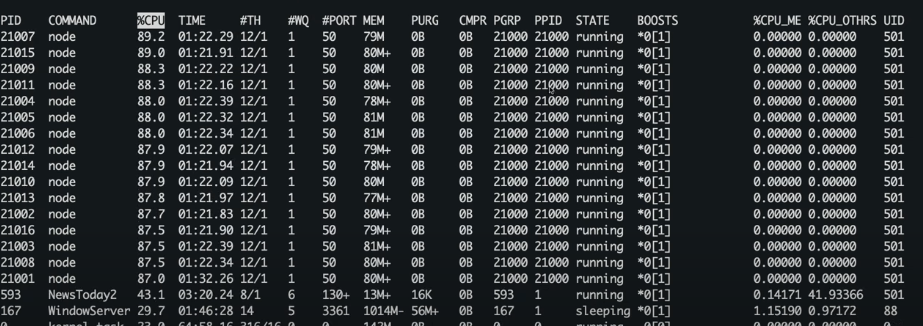

# Nodejs Worker Threads & PM2

## Scripts

### PM2

```bash
npm install -g pm2@latest
```

```bash
pm2 start dist/main.js -i max
```

```bash
pm2 ls
```

```bash
pm2 stop dist/main.js
```

### Load Testing

```bash
npm install -g artillery@latest
```

```bash
npm install -g artillery@latest
```

```bash
artillery run ./artillery.yaml
```

### top

```bash
top
```

- all the node processes that PM2 is actually running and the underlying CPU usage for them
- PM2 is distributing these incoming requests from artillery and then load balancing them to all these node processes


