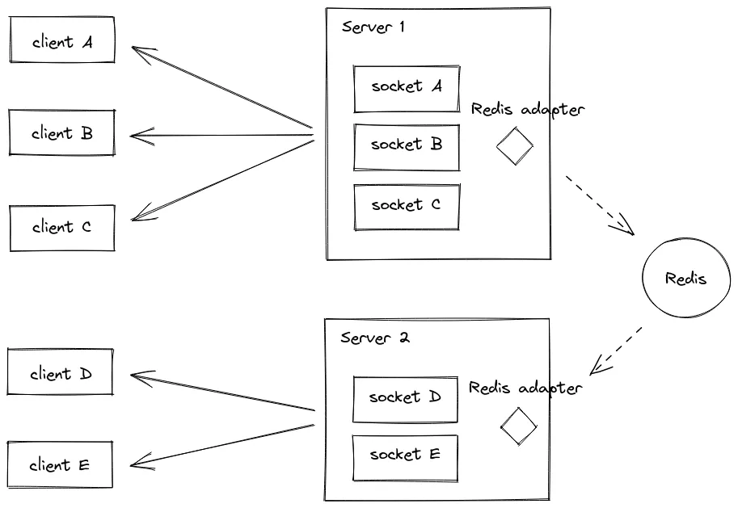

# Scaling Web Sockets using Redis Pub/Sub

Scaling Web Sockets involves distributing real-time messages efficiently across multiple servers or instances. Pub/Sub (Publish/Subscribe) is a pattern used to achieve this.

- **Publishers**: When a user sends a message through a Websocket connection, the server publishes the message to a Pub/Sub system.
- **Subscribers**: All server instances subscribe to the relevant channels in the Pub/Sub system. Each subscriber receives a copy of the message.
- **Distribution**: The Pub/Sub system ensures that the message reaches all subscribers across different servers. This allows all connected clients to receive the message.

## Integrating Redis Pub/Sub

To scale socket connections across multiple instances of your Express.js server, we use Redis Pub/Sub as a message broker. Redis provides a publish-subscribe mechanism that allows different processes or servers to communicate with each other.
